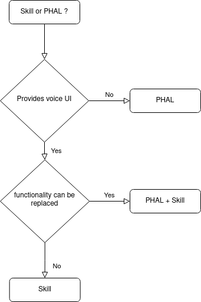

# PHAL

[PHAL](https://github.com/OpenVoiceOS/ovos_PHAL) is our Platform/Hardware Abstraction Layer, it completely replaces the
concept of hardcoded "enclosure" from mycroft-core

Any number of plugins providing functionality can be loaded and validated at runtime, plugins can
be [system integrations](https://github.com/OpenVoiceOS/ovos-PHAL-plugin-system) to handle things like reboot and
shutdown, or hardware drivers such as [mycroft mark2 plugin](https://github.com/OpenVoiceOS/ovos-PHAL-plugin-mk2)

PHAL plugins can perform actions such as hardware detection before loading, eg, the mark2 plugin will not load if it
does not detect the sj201 hat. This makes plugins safe to install and bundle by default in our base images

You can find a list of plugins under the [OPM documentation](https://openvoiceos.github.io/community-docs/OPM/#phal)

## Plugin or Skill

In mycroft-core the equivalent to PHAL plugins would usually be shipped as skills or hardcoded

in OVOS sometimes it may be unclear if we should develop a skill or plugin, there isn't a one size fits all answer, in some circumstances it may make sense to create both a plugin and a companion skill

- does it need a voice interface?
- can the underlying functionality be replaced while keeping the voice/gui interface?
- is underlying functionality replaceable?

